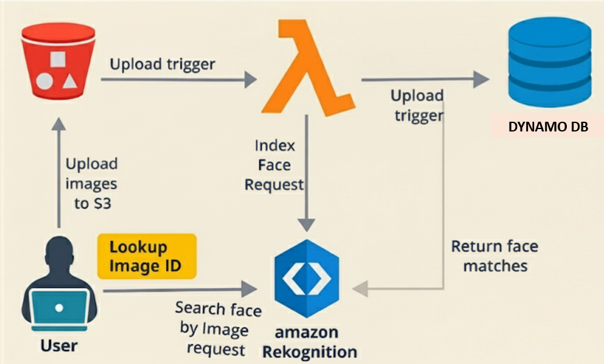

# 🕵️ Intelligent Cloud-Based Criminal Identification System  

 <!-- Replace with your diagram file -->

---

## 📌 Overview  
The **Intelligent Cloud-Based Criminal Identification System** leverages **AWS Rekognition, S3, DynamoDB, and Lambda** to automatically detect, store, and identify criminals from uploaded images.  

With a **Tkinter-based GUI**, this system provides real-time criminal identification with details like **Name, Crime Type, and Wanted Status**.  

 

## ✨ Features  

- **Automatic Face Detection & Indexing** using AWS Rekognition  
- **Metadata Storage** (Name, Crime Type, Wanted Status) in S3 + DynamoDB  
- **Lambda Automation** on image upload  
- **Tkinter GUI** for live face matching and visualization  
- **Flash & Fade Effects** for real-time results  
- **Scalable & Cloud-Native** architecture  

---

## 🏗️ System Architecture  
```text
[Upload Image] 
      |
      v
 [S3 Bucket]
      |
      v
 [Lambda Function]
   /           \
  v             v
[Rekognition]  [DynamoDB]
      |
      v
   [GUI]
      |
      v
[Criminal Info]

🚀 Tech Stack

☁️ Cloud: AWS Rekognition, S3, DynamoDB, Lambda

🎨 Frontend: Python Tkinter GUI

⚙️ Backend: Python (Boto3 SDK)

🗄️ Database: DynamoDB (NoSQL)
